# Validazione `data/questions.json`

- Sorgente: `210926_Conseguimento A-B italiano.pdf` — listato del **26/09/2021**, PDF generato il 17/09/2026, 586 pagine
- SHA-256 PDF: `fc52aaabda2256eaa711b30a85505316c9f563a9d632d210fa8e0c9aa84bf239`
- Affermazioni: **7020** · quesiti: 715 · con figura: 3919 · figure uniche: 407 · VERO: 3524 · FALSO: 3496
- Esito complessivo: **✅ TUTTI I CONTROLLI SUPERATI**

## Controlli

| | Controllo | Dettaglio |
|---|---|---|
| ✅ | Conteggio VERO/FALSO nel testo grezzo del PDF = affermazioni estratte | PDF 7020, estratte 7020 |
| ✅ | Conteggio intestazioni 'Quesito n°' nel PDF = quesiti estratti | PDF 715, estratti 715 |
| ✅ | Immagini nella colonna 'Immagine' del PDF = affermazioni con figura | PDF 3919, estratte 3919 |
| ✅ | 25 argomenti presenti | trovati 25 |
| ✅ | Somma quote scheda d'esame = 30 | somma 30 |
| ✅ | Ogni affermazione ha risposta V/F valida | 0 non valide |
| ✅ | Nessuna anomalia segnalata dall'estrazione | 0 anomalie |
| ✅ | Nessun id duplicato | duplicati: [] |
| ✅ | Nessun testo vuoto | [] |
| ✅ | Nessun residuo di intestazioni/risposte nel testo | [] |
| ✅ | Nessun testo sospettosamente corto (< 20 caratteri) |  |
| ✅ | Nessun testo con finale anomalo (possibile troncamento) |  |
| ✅ | Nessun carattere di encoding anomalo nei testi | [] |
| ✅ | Ogni figura referenziata esiste | mancanti: [] |
| ✅ | Nessuna immagine orfana | orfane: [] |

## Conteggio per argomento

| # | Argomento | Affermazioni | Quesiti | Con figura | Quota scheda |
|---:|---|---:|---:|---:|---:|
| 1 | Definizioni stradali e di traffico; definizioni e classificazione dei veicoli; doveri del conducente nell'uso della strada… | 516 | 50 | 30 | 2 |
| 2 | Segnali di pericolo | 658 | 54 | 658 | 2 |
| 3 | Segnali di divieto | 497 | 44 | 497 | 2 |
| 4 | Segnali di obbligo | 423 | 40 | 423 | 2 |
| 5 | Segnali di precedenza | 242 | 20 | 242 | 1 |
| 6 | Segnaletica orizzontale; segni sugli ostacoli | 257 | 30 | 239 | 1 |
| 7 | Segnalazioni semaforiche; segnalazioni degli agenti del traffico | 251 | 27 | 222 | 1 |
| 8 | Segnali di indicazione | 598 | 63 | 598 | 2 |
| 9 | Segnali complementari; segnali temporanei e di cantiere | 178 | 19 | 178 | 1 |
| 10 | Pannelli integrativi dei segnali | 260 | 25 | 260 | 1 |
| 11 | Limiti di velocità; pericolo e intralcio alla circolazione; comportamenti ai passaggi a livello | 251 | 20 | 6 | 1 |
| 12 | Distanza di sicurezza | 134 | 15 | 0 | 1 |
| 13 | Norme sulla circol. dei veicoli; pos. dei veicoli sulla carreggiata; cambio di direz. di corsia (svolta); comp. in presenza di… | 374 | 39 | 53 | 1 |
| 14 | Esempi di precedenza (ordine di precedenza agli incroci) | 414 | 49 | 414 | 1 |
| 15 | Norme sul sorpasso | 155 | 10 | 0 | 1 |
| 16 | Fermata, sosta, arresto e partenza | 183 | 23 | 1 | 1 |
| 17 | Ingombro della carreggiata; segnalazione di veicolo fermo; norme sulla circolazione in autostrada e strade extraurbane | 318 | 41 | 28 | 1 |
| 18 | Uso delle luci; uso dei dispositivi acustici; spie e simboli | 174 | 22 | 70 | 1 |
| 19 | Dispositivi di equipaggiamento: funzione ed uso; cinture di sicurezza e sistemi di ritenuta per bambini; casco protettivo… | 133 | 12 | 0 | 1 |
| 20 | Patenti di guida; documenti di circolazione del veicolo; obbligo verso funzionari ed agenti; sistema sanzionatorio; patente a… | 208 | 18 | 0 | 1 |
| 21 | Comportamenti per prevenire incidenti stradali; comportamento in caso di incidente stradale; peculiarità della guida di… | 126 | 13 | 0 | 1 |
| 22 | Guida in relazione alle qualità e condizioni fisiche e psichiche; alcool, droga e farmaci ; primo soccorso | 141 | 21 | 0 | 1 |
| 23 | Responsabilità civile, penale, amministrativa; assicurazione R.C.A.; altre forme assicurative legate al veicolo | 145 | 15 | 0 | 1 |
| 24 | Limitazione dei consumi; rispetto dell'ambiente; inquinamento: atmosferico, acustico, da cattivo smaltimento dei rifiuti | 103 | 15 | 0 | 1 |
| 25 | Elementi costitutivi del veicolo importanti per la sicurezza; manutenzione ed uso; stabilità e tenuta di strada del veicolo… | 281 | 30 | 0 | 1 |
| | **Totale** | **7020** | **715** | **3919** | **30** |

## Note (non bloccanti)

- I nomi di 6 argomenti sono troncati nel PDF stesso: sono mostrati con `…`, senza inventare il seguito.
- Nell'intestazione dell'argomento "Limitazione dei consumi…" il PDF codifica l'apostrofo come `¿`: corretto in `'`.
- La ripartizione per argomento (colonna *Quota scheda*) non è pubblicata ufficialmente: è configurata in `config/argomenti.json`.
- Testi identici ripetuti nello stesso argomento (presenti così nel PDF, con numeri diversi): 150.
- Affermazioni con trattino interno (parole composte, a capo unito senza spazio): 28.

## Campione casuale di 20 affermazioni (seed 20260928)

Verifica ciascuna contro il PDF alla pagina indicata (il ritaglio è preso dal PDF originale).

### 1. Domanda 23973 — pagina 535

- Argomento: Ingombro della carreggiata; segnalazione di veicolo fermo; norme sulla circolazione in autostrada e strade extraurbane (quesito 4553)
- Testo estratto: Il conducente di autoveicolo deve prevedere manovre improvvise altrui, come il procedere a zig-zag di un ciclomotore
- Risposta: **VERO** · Figura: nessuna

Ritaglio PDF: 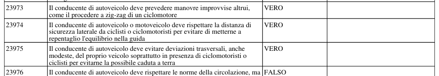

### 2. Domanda 22379 — pagina 488

- Argomento: Limiti di velocità; pericolo e intralcio alla circolazione; comportamenti ai passaggi a livello (quesito 4379)
- Testo estratto: Il limite massimo di velocità sulle autostrade è di 70 km/h per autovettura che traina un caravan
- Risposta: **FALSO** · Figura: nessuna

Ritaglio PDF: 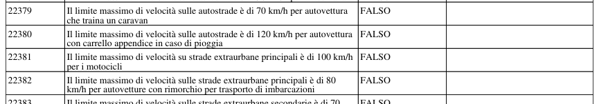

### 3. Domanda 19666 — pagina 279

- Argomento: Segnali di divieto (quesito 4117)
- Testo estratto: Il segnale raffigurato vieta il transito alle biciclette
- Risposta: **VERO** · Figura: `figures/58ee2fad4c298693.jpg`

Ritaglio PDF: 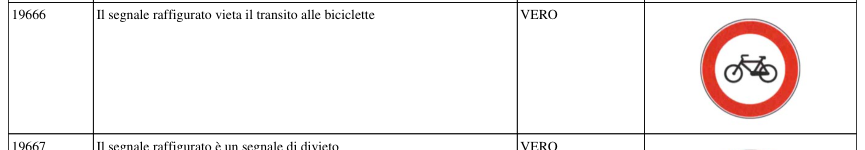
 Figura estratta: 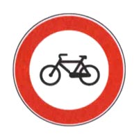

### 4. Domanda 23984 — pagina 535

- Argomento: Ingombro della carreggiata; segnalazione di veicolo fermo; norme sulla circolazione in autostrada e strade extraurbane (quesito 4555)
- Testo estratto: Risulta maggiormente pericolosa la collisione tra veicoli dotati di masse molto diverse tra loro
- Risposta: **VERO** · Figura: nessuna

Ritaglio PDF: 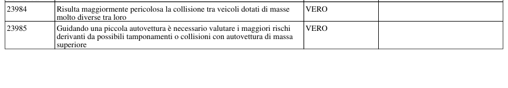

### 5. Domanda 24933 — pagina 566

- Argomento: Guida in relazione alle qualità e condizioni fisiche e psichiche; alcool, droga e farmaci ; primo soccorso (quesito 4652)
- Testo estratto: Se un ferito della strada si è ustionato, bisogna sempre togliere le parti dei vestiti che sono rimaste attaccate alla pelle
- Risposta: **FALSO** · Figura: nessuna

Ritaglio PDF: 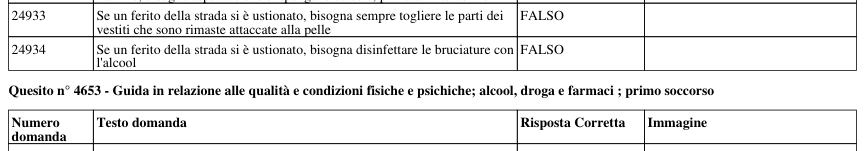

### 6. Domanda 24665 — pagina 556

- Argomento: Patenti di guida; documenti di circolazione del veicolo; obbligo verso funzionari ed agenti; sistema sanzionatorio; patente a… (quesito 4621)
- Testo estratto: Gareggiare in velocità su piste private, avendo meno di 24 anni e la sola patente B, comporta una perdita di punti sulla patente
- Risposta: **FALSO** · Figura: nessuna

Ritaglio PDF: 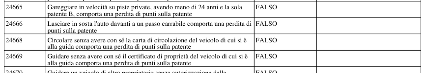

### 7. Domanda 25324 — pagina 580

- Argomento: Elementi costitutivi del veicolo importanti per la sicurezza; manutenzione ed uso; stabilità e tenuta di strada del veicolo… (quesito 4706)
- Testo estratto: Una frenatura poco efficiente può essere causata da eccessive e ripetute frenate
- Risposta: **VERO** · Figura: nessuna

Ritaglio PDF: 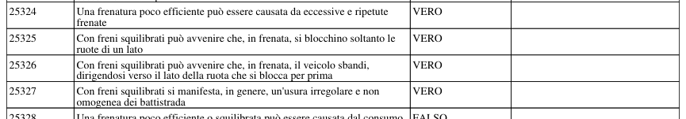

### 8. Domanda 21364 — pagina 33

- Argomento: Segnali di indicazione (quesito 4280)
- Testo estratto: Il segnale raffigurato preavvisa un'area di sosta a destra
- Risposta: **FALSO** · Figura: `figures/2aa28abe7af0cb52.jpg`

Ritaglio PDF: 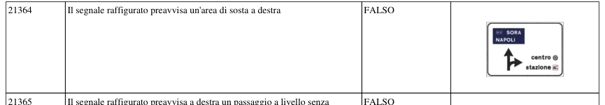
 Figura estratta: 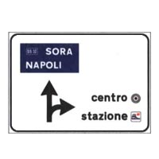

### 9. Domanda 19393 — pagina 214

- Argomento: Segnali di pericolo (quesito 4094)
- Testo estratto: Il segnale raffigurato preannuncia un tratto di strada deformata
- Risposta: **FALSO** · Figura: `figures/671f30878dbad211.jpg`

Ritaglio PDF: 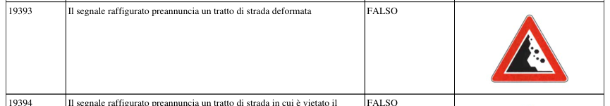
 Figura estratta: 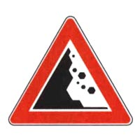

### 10. Domanda 23120 — pagina 96

- Argomento: Esempi di precedenza (ordine di precedenza agli incroci) (quesito 4455)
- Testo estratto: Secondo le norme di precedenza nell'incrocio rappresentato in figura i veicoli D e B passano contemporaneamente
- Risposta: **FALSO** · Figura: `figures/d61d2c992cc65dec.jpg`

Ritaglio PDF: 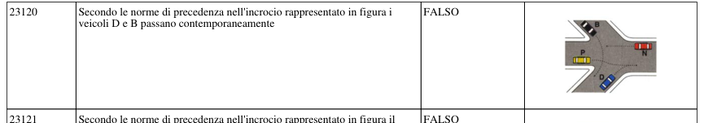
 Figura estratta: 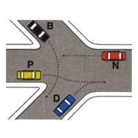

### 11. Domanda 24917 — pagina 565

- Argomento: Guida in relazione alle qualità e condizioni fisiche e psichiche; alcool, droga e farmaci ; primo soccorso (quesito 4650)
- Testo estratto: Se un infortunato della strada ha avuto un trauma della gabbia toracica, bisogna fargli fare profondi respiri
- Risposta: **FALSO** · Figura: nessuna

Ritaglio PDF: 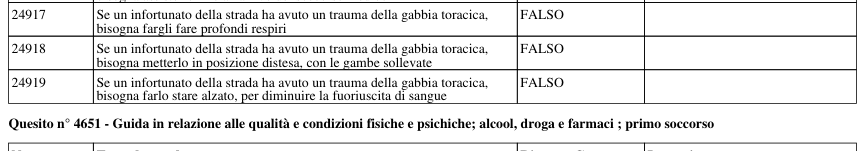

### 12. Domanda 24289 — pagina 441

- Argomento: Uso delle luci; uso dei dispositivi acustici; spie e simboli (quesito 4589)
- Testo estratto: Una spia di colore rosso contrassegnata dal simbolo di figura, se accesa durante la marcia, indica che bisogna invertire l'allacciamento dei cavi ai morsetti della batteria
- Risposta: **FALSO** · Figura: `figures/6930d17e542f1724.jpg`

Ritaglio PDF: 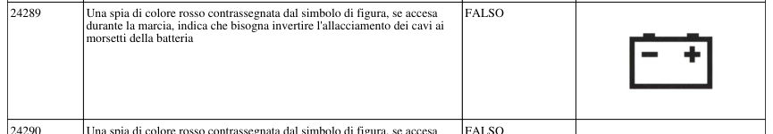
 Figura estratta: 

### 13. Domanda 24311 — pagina 350

- Argomento: Uso delle luci; uso dei dispositivi acustici; spie e simboli (quesito 4591)
- Testo estratto: Una spia di colore rosso contrassegnata dal simbolo di figura, se accesa durante la marcia, segnala portiere aperte o chiuse non correttamente
- Risposta: **FALSO** · Figura: `figures/3fed4aa0907d7142.jpg`

Ritaglio PDF: 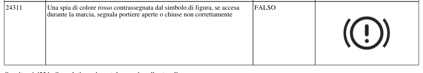
 Figura estratta: 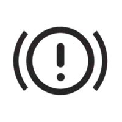

### 14. Domanda 23005 — pagina 514

- Argomento: Norme sulla circol. dei veicoli; pos. dei veicoli sulla carreggiata; cambio di direz. di corsia (svolta); comp. in presenza di… (quesito 4446)
- Testo estratto: Lo specchio retrovisore centrale di un autoveicolo deve essere posizionato in modo da rientrare nel campo visivo del conducente
- Risposta: **VERO** · Figura: nessuna

Ritaglio PDF: 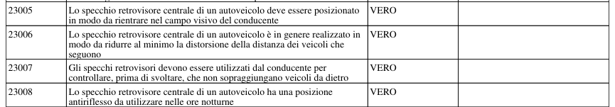

### 15. Domanda 19242 — pagina 196

- Argomento: Segnali di pericolo (quesito 4082)
- Testo estratto: Il segnale raffigurato preannuncia una strada con una serie di curve
- Risposta: **FALSO** · Figura: `figures/e2ccee1005ddb68a.jpg`

Ritaglio PDF: 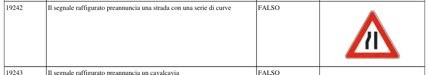
 Figura estratta: 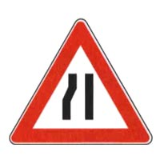

### 16. Domanda 24162 — pagina 542

- Argomento: Uso delle luci; uso dei dispositivi acustici; spie e simboli (quesito 4574)
- Testo estratto: Durante la marcia fuori dai centri abitati, è obbligatorio fare uso delle luci anabbaglianti, sia di giorno che di notte
- Risposta: **VERO** · Figura: nessuna

Ritaglio PDF: 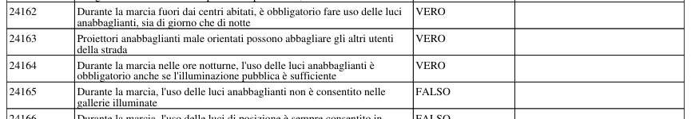

### 17. Domanda 20068 — pagina 334

- Argomento: Segnali di obbligo (quesito 4152)
- Testo estratto: Il segnale raffigurato, posto prima di un incrocio, obbliga a svoltare a sinistra
- Risposta: **VERO** · Figura: `figures/91e641c35a2eb06c.jpg`

Ritaglio PDF: 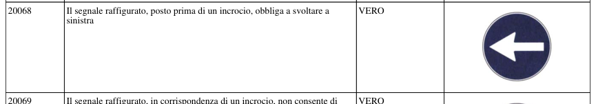
 Figura estratta: 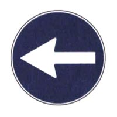

### 18. Domanda 20937 — pagina 463

- Argomento: Segnaletica orizzontale; segni sugli ostacoli (quesito 4236)
- Testo estratto: La striscia bianca laterale discontinua in figura individua il bordo della strada principale, separandolo da quello della strada secondaria
- Risposta: **VERO** · Figura: `figures/cc950cdab16927a9.jpg`

Ritaglio PDF: 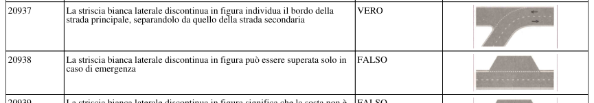
 Figura estratta: 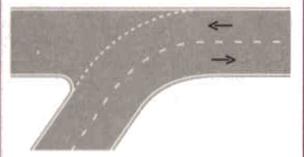

### 19. Domanda 25184 — pagina 575

- Argomento: Elementi costitutivi del veicolo importanti per la sicurezza; manutenzione ed uso; stabilità e tenuta di strada del veicolo… (quesito 4688)
- Testo estratto: Se il coefficiente di aderenza è basso bisogna ridurre la velocità solo in curva
- Risposta: **FALSO** · Figura: nessuna

Ritaglio PDF: 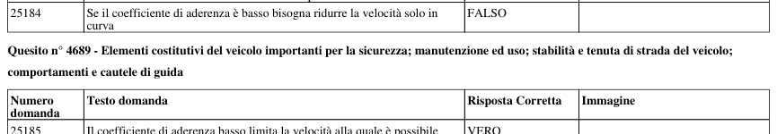

### 20. Domanda 18478 — pagina 447

- Argomento: Definizioni stradali e di traffico; definizioni e classificazione dei veicoli; doveri del conducente nell'uso della strada… (quesito 4016)
- Testo estratto: La corsia può essere destinata alla normale marcia dei veicoli
- Risposta: **VERO** · Figura: nessuna

Ritaglio PDF: 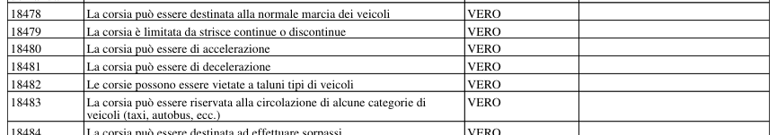
